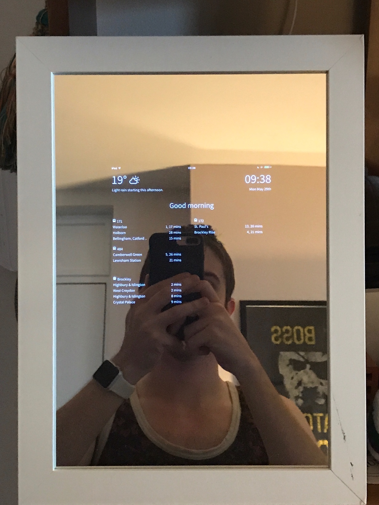

# Mirage

A dashboard web app.

The idea is that you put it on an always on tablet on the wall or something,
and then leave it on all the time.

Currently supports weather, UK rail stations, and TfL stations.

## How it looks

The UI looks like this:


Set up behind a two-way mirror, it looks like this:


## How To Use

### Prerequisites

You need NodeJS (6.0 or higher) with NPM.

You need API keys from [forecast.io](https://darksky.net/dev/) and
[transportapi](http://www.transportapi.com/). The free tier should be sufficient
for both.

### Build & Run

1. Make a copy of `config.example.json`, naming it `config.json`. In there,
fill in the necessary info (more on that below).
1. Install dependencies with `npm install`.
1. Run with `npm run app`.
1. Go to localhost:3000 to view it.

## Config

* Geo data is needed to get the weather.
* `TflLines` takes an array of objects. These map to data from the TfL arrivals API. For example https://api.tfl.gov.uk/Line/484/Arrivals. You can find the official name of your bus stop or station by looking at the API in your browser. Or on Citymapper.
* `trainStation` takes a 3 letter station code. You can find these on Wikipedia.
* `dateMessages` is an optional array of extra messages to display based on the current date. Dates must not be zero-padded.

## Other notes

* Optimised for 768x1024 displays (e.g. an iPad in portrait mode).
* UI is very minimal because it's designed to go behind a two way mirror.
* Data refreshes every 2 minutes, and when a new user connects.
* Trains and TfL data don't update before 5am, to save on API calls when they aren't running.
* TfL stuff works for both buses and tube.

## Running on a server

Currently I have a Raspberry Pi to run this app. I tried using systemd but couldn't
get on with it, so I'm now trying [forever](https://www.npmjs.com/package/forever).

So, to start the app running in forever, run `npm run start-bkgrnd`. Run `npm run stop-bkgrnd` to
stop it.

To abstract this into a command that runs whenever the server starts, you can use Crontab.
[This StackOverflow answer](http://stackoverflow.com/a/13388741) got me started with it.
For reference, the command I'm having Crontab run is:

```
@reboot /usr/bin/npm run start-bkgrnd --prefix ~/code/mirage
```
